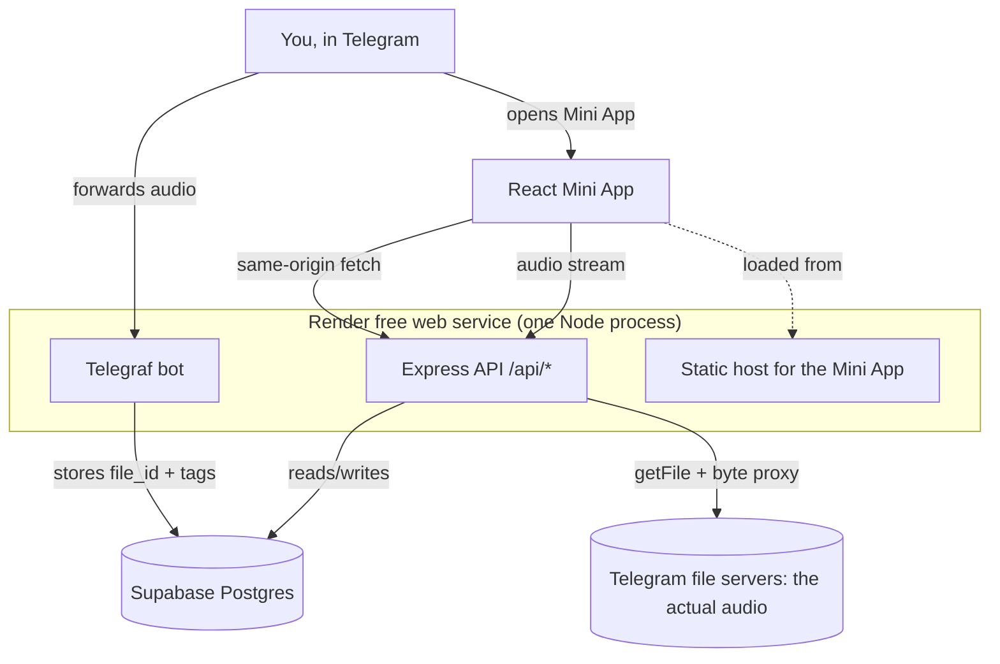

# Navaar — Project Reference

Navaar is a personal, Spotify-style music library that lives entirely inside
Telegram. You forward audio files to a Telegram bot; the bot records them, and a
Telegram Mini App lets you browse, play, tag, and organise them into playlists.

The defining design choice: **Navaar never stores your audio.** Telegram already
hosts every file you send it, indefinitely. Navaar stores only the `file_id`
Telegram hands back, and re-resolves that ID to a download URL on demand when you
press play. That single decision is why the whole system runs on free tiers with
no object storage, no bandwidth bill, and no storage quota to manage.

> **Naming note.** The product is *Navaar*. The repository, package names, and
> service names still use the working title "Telegram Music Player"
> (`telegram-music-player-server`, `telegram-music-player-web`). Renaming them is
> cosmetic but touches Render's service identity and the Blueprint, so it hasn't
> been done. Treat "Telegram Music Player" in the code as the old name for Navaar.

---

## 1. System at a glance



Three external services, all on free plans:

| Piece | Provider | Role |
|---|---|---|
| Bot + API + static frontend | **Render** (free web service) | One Node process does all three |
| Database | **Supabase** (free Postgres) | Users, tracks, playlists, cover art bytes |
| Audio storage | **Telegram** | Holds the actual audio files, indefinitely, for free |

There is deliberately **no object storage**. An earlier iteration used Cloudflare
R2 — you can still see its fossils in `migrations/001_init.up.sql` (`r2_audio_key`,
`r2_cover_key`) and in a stale comment in [app.ts](server/src/app.ts). Migration
002 tore it out.

---

## 2. Repository layout

```
/
├── render.yaml                 Render Blueprint (one web service, env var slots)
├── README.md                   Setup walkthrough (partly stale — see §11)
├── PROJECT.md                  This document
├── server/                     Telegraf bot + Express API + static host
│   ├── src/
│   │   ├── index.ts            Entrypoint: bot mode (webhook vs polling) + listen
│   │   ├── config.ts           Env var access; optional() vs required()
│   │   ├── app.ts              Express: logging, /health, /api, static, SPA fallback
│   │   ├── bot.ts              Telegraf handlers (/start, audio, audio documents)
│   │   ├── audio-ingest.ts     Incoming Telegram audio message -> track row
│   │   ├── telegram-auth.ts    Validates Mini App initData (HMAC per Telegram spec)
│   │   ├── telegram-files.ts   file_id -> time-limited Telegram download URL
│   │   ├── jwt.ts              Session token sign/verify
│   │   ├── middleware.ts       requireAuth (Bearer header or ?token= query)
│   │   ├── db.ts               Lazy pg Pool
│   │   ├── repo.ts             All SQL; every query scoped by owner_telegram_id
│   │   ├── migrate.ts          Tiny forward-only migration runner
│   │   ├── asyncHandler.ts     Async route wrapper -> error middleware
│   │   ├── types.ts            Track, Playlist
│   │   └── routes/             auth.ts, tracks.ts, playlists.ts
│   ├── migrations/             001_init, 002_telegram_storage (.up/.down)
│   └── web-dist/               Built Mini App, copied here at build time (gitignored)
├── web/                        React + Vite + Tailwind Mini App
│   ├── src/
│   │   ├── main.tsx            React root
│   │   ├── App.tsx             All app state + view switching
│   │   ├── api.ts              Typed API client + session token storage
│   │   ├── telegram.ts         window.Telegram.WebApp accessor
│   │   ├── view.ts             View union (library | playlists | playlist)
│   │   ├── types.ts            Mirrors server types.ts
│   │   ├── index.css           Tailwind v4 theme tokens
│   │   ├── context/PlayerContext.tsx   The <audio> element + playback state
│   │   └── components/         Nav, NowPlayingBar, TrackList, TrackRow,
│   │                           TrackEditModal, PlaylistsView, PlaylistDetailView
│   ├── scripts/copy-telegram-sdk.mjs   Self-hosts Telegram's SDK (see §9)
│   └── wrangler.toml           Vestigial — Cloudflare Pages is no longer used
└── supabase/                   Only Supabase CLI temp state (gitignored)
```

---

## 3. The server process

One `node dist/index.js` does three jobs. [index.ts](server/src/index.ts) decides
the bot's transport, then starts Express.

**Bot transport is env-driven:**

- `WEBHOOK_URL` set (production) → webhook mode. Telegraf mounts a handler at
  `/telegraf/<secret>` and registers that URL with Telegram.
- `WEBHOOK_URL` empty (local dev) → long polling. No public URL needed.

This isn't just convenience. Render's free tier **sleeps the service after ~15
minutes idle**, and only an inbound HTTP request wakes it. A long-polling bot
would silently stop pulling updates once asleep and never wake itself. A webhook
delivery *is* an inbound request, so it wakes the service and gets processed.
`bot.launch()` is deliberately not awaited (it only resolves when polling stops)
and its rejection is caught, so a bot failure can't take the API down with it.

**Express** ([app.ts](server/src/app.ts)), in order:

1. **Request logger** — method, URL, status, duration, User-Agent for every
   request. Render captures stdout as the service's only log stream, and the UA
   is what distinguishes Telegram's in-app WebView from a normal browser.
2. `GET /health` → `{ ok: true, botEnabled }`. Render's health check path.
3. `express.json()` **scoped to `/api`** — this matters: Telegraf's webhook route
   is mounted outside `/api` and needs the raw, unconsumed body to parse updates.
4. `/api/auth`, `/api/tracks`, `/api/playlists` routers.
5. `express.static(web-dist)`, then an SPA fallback serving `index.html` for
   anything not matching `api|health|telegraf`.
6. Error middleware — catches anything `asyncHandler` forwards, logs it, and
   returns a 500 instead of crashing the process.

**Config** ([config.ts](server/src/config.ts)) reads every var as *optional* and
exposes a `required(name)` helper that throws at the point of use. So a server
missing `DATABASE_URL` still boots and serves `/health`; it only fails on routes
that actually need the database. A missing `BOT_TOKEN` disables the bot and logs
"API-only mode".

---

## 4. Data model

Four tables. See [001_init.up.sql](server/migrations/001_init.up.sql) and
[002_telegram_storage.up.sql](server/migrations/002_telegram_storage.up.sql).

```
users
  telegram_user_id  BIGINT PK        <- Telegram's user ID is the identity; no passwords
  username          TEXT
  created_at        TIMESTAMPTZ

tracks
  id                UUID PK
  owner_telegram_id BIGINT FK -> users ON DELETE CASCADE
  title, artist, album   TEXT        <- editable metadata, DB-only
  duration_seconds  INTEGER
  telegram_file_id  TEXT NOT NULL    <- the whole storage strategy, in one column
  mime_type         TEXT
  cover_image       BYTEA            <- cover art stored inline in Postgres,
                                        captured at ingest (§6) or uploaded
  cover_mime_type   TEXT
  created_at        TIMESTAMPTZ

playlists
  id                UUID PK
  owner_telegram_id BIGINT FK -> users ON DELETE CASCADE
  name              TEXT NOT NULL
  created_at        TIMESTAMPTZ

playlist_tracks
  playlist_id  UUID FK -> playlists ON DELETE CASCADE
  track_id     UUID FK -> tracks    ON DELETE CASCADE
  position     INTEGER
  PRIMARY KEY (playlist_id, track_id)
```

Two conventions run through the whole data layer:

- **Every table is owner-scoped, and every query enforces it.** There is no
  shared or global library. [repo.ts](server/src/repo.ts) never takes an ID
  without also taking `ownerTelegramId` and putting it in the `WHERE` clause.
  `addPlaylistTrack` goes further: before inserting, it verifies in a single
  query that *both* the playlist and the track belong to the caller, rather than
  trusting the IDs it was handed.
- **Cover bytes are never pulled unless asked for.** `repo.ts` defines a shared
  `TRACK_COLUMNS` list that omits `cover_image` and instead selects
  `(cover_image IS NOT NULL) AS has_cover`. So listing 500 tracks doesn't drag
  500 JPEGs over the wire; the UI just learns which tracks have art and fetches
  those individually from `/api/tracks/:id/cover`.

**Migrations** are forward-only, applied by [migrate.ts](server/src/migrate.ts):
it creates a `schema_migrations` table, reads `migrations/*.up.sql` in sorted
order, and applies each unapplied file inside a transaction. `.down.sql` files
exist for reference but the runner never executes them.

---

## 5. Authentication

Navaar has no login screen. Identity comes from Telegram itself.

**Step 1 — the Mini App proves who you are.** When Telegram opens a Mini App it
injects `window.Telegram.WebApp.initData`: a signed query string containing your
user object, an `auth_date`, and an HMAC `hash`. The app POSTs it verbatim to
`/api/auth/telegram`.

**Step 2 — the server verifies it** in
[telegram-auth.ts](server/src/telegram-auth.ts), following Telegram's documented
algorithm exactly:

1. Strip `hash` from the params, sort the rest by key, join as `k=v` lines.
2. `secret = HMAC_SHA256("WebAppData", BOT_TOKEN)`.
3. `expected = HMAC_SHA256(secret, dataCheckString)`.
4. Compare against the provided hash with `timingSafeEqual`.
5. Reject if `auth_date` is more than **24 hours** old (replay protection).

Only someone holding your bot token could forge this, so a valid hash is proof
the payload came from Telegram and names a real user.

**Step 3 — the server issues a session.** `ensureUser()` upserts the user row,
then [jwt.ts](server/src/jwt.ts) signs a **7-day** JWT with `sub` = the Telegram
user ID. The client stores it in `localStorage` under `session_token`.

**Step 4 — subsequent requests.** [middleware.ts](server/src/middleware.ts)
accepts the token two ways:

- `Authorization: Bearer <token>` — used by all JSON calls.
- `?token=<token>` query parameter — required because native `<audio src>` and
  `` tags **cannot set request headers**. The stream and cover routes
  are consumed by those tags, so the token has to ride in the URL.

That query-param path is a real tradeoff, not an oversight — but see §11, because
it currently interacts badly with the request logger.

---

## 6. Ingesting a track

Handled by [bot.ts](server/src/bot.ts) → [audio-ingest.ts](server/src/audio-ingest.ts).

The bot listens for two message types: `audio` (Telegram's music type, which
carries parsed `title`, `performer`, and `duration`) and `document` where the MIME
type starts with `audio/` (files sent "as file", with no parsed tags).

For each one:

1. `ensureUser()` — upsert the sender, so forwarding a file is also your signup.
2. **Size gate.** The standard Bot API refuses to serve downloads over **20 MB**.
   If Telegram reported a `file_size` above that, reject immediately with a clear
   message.
3. **`getFile` probe.** Call `getFile` once to confirm the file is actually
   fetchable — this also catches the too-big case when Telegram didn't report a
   size up front (Telegram answers with a "too big" error, which is matched and
   converted to the same friendly `AudioTooLargeError`).
4. **Capture the cover art** ([cover-art.ts](server/src/cover-art.ts)). Two
   ranged requests read just the ID3v2 tag off the front of the file — never the
   audio payload — and the attached-picture frame (`APIC`, or `PIC` on v2.2) is
   pulled out, preferring the one marked *front cover*. If the file has no
   embedded picture, Telegram's own album-cover thumbnail is used instead:
   `Audio.thumbnail` is documented as "thumbnail of the album cover to which the
   music file belongs", though at 320px and only present on the original
   message. Either way the bytes go into `cover_image`. This step can never fail
   an ingest — `resolveCoverArt` swallows its own errors and returns `null`.
5. **Insert a row** with the `file_id`, whatever tags Telegram parsed, the cover
   art if one was found, and a fallback title derived from the filename with its
   extension stripped.
6. Reply with a confirmation and an **"Open Music Player"** inline button that
   launches the Mini App (only rendered if `MINI_APP_URL` is configured).

**The audio itself is never downloaded, copied, or stored.** Step 3 fetches only
metadata, and step 4 reads only the tag header. The 20 MB ceiling is a limit of
the *standard* Bot API; lifting it would require running a self-hosted Bot API
server, which this project deliberately does not do.

**`/covers` backfills artwork.** Covers are captured at ingest, so the command
only matters for tracks added before that existed, or whose art couldn't be read
at the time. It scans your coverless tracks (up to 25 per run, so the handler
finishes well inside Telegram's webhook timeout) and re-derives the artwork from
each stored `file_id`. Embedded art is recoverable from the `file_id` alone,
which is exactly why it's preferred over the thumbnail — the thumbnail exists
only on the original message and is gone once that message has been processed.

---

## 7. Playback: the streaming proxy

The most interesting route, in [routes/tracks.ts](server/src/routes/tracks.ts):

```
GET /api/tracks/:id/stream?token=<jwt>
```

1. Authenticate, then load the track **scoped to the caller** — a 404 for anyone
   else's track ID.
2. Call Telegram's `getFile` to turn the stored `file_id` into a download URL of
   the form `https://api.telegram.org/file/bot<TOKEN>/<path>`. These URLs are
   time-limited (roughly an hour), which is exactly why the `file_id` is what's
   persisted rather than the URL.
3. **Forward the browser's `Range` header upstream**, then mirror Telegram's
   response back: copy `Content-Length`, and on a partial response set status
   `206` plus `Content-Range`; always advertise `Accept-Ranges: bytes`.
4. Pipe the upstream body straight to the response via
   `Readable.fromWeb(...).pipe(res)` — streaming, never buffering the file in
   memory.

Range forwarding is what makes the scrubber work. Dragging the seek bar sets
`audio.currentTime`, the browser issues a fresh ranged request, and the server
relays it — so seeking into the middle of a track doesn't download everything
before it.

The proxy exists for one non-negotiable reason: **the download URL embeds the bot
token.** Handing it to the client would leak full control of the bot. Proxying
keeps the token server-side, and has the side benefit that the client only ever
talks to one origin.

**Cover art** takes the opposite route — `GET /api/tracks/:id/cover` reads the
`BYTEA` column straight out of Postgres and sends it with its stored MIME type.
Covers are small and few, so inlining them in the database avoids introducing an
object store just for thumbnails.

---

## 8. HTTP API reference

All `/api` routes except `POST /api/auth/telegram` require a session token and
operate strictly on the caller's own rows.

### Auth
| Method | Path | Body | Response |
|---|---|---|---|
| POST | `/api/auth/telegram` | `{ initData }` | `{ token }` · 400 missing · 401 invalid |

### Tracks
| Method | Path | Notes |
|---|---|---|
| GET | `/api/tracks` | All your tracks, newest first. No cover bytes; `has_cover` flag instead |
| GET | `/api/tracks/:id/stream` | Proxied audio; honours `Range`, returns 206 · 502 if Telegram fails |
| GET | `/api/tracks/:id/cover` | Raw cover bytes · 404 if none |
| PATCH | `/api/tracks/:id` | `{ title?, artist?, album? }` → updated track |
| POST | `/api/tracks/:id/cover` | `multipart/form-data`, field `cover`, **5 MB cap** (multer, in memory) |

### Playlists
| Method | Path | Notes |
|---|---|---|
| GET | `/api/playlists` | Your playlists, newest first |
| POST | `/api/playlists` | `{ name }` → 201 |
| PATCH | `/api/playlists/:id` | `{ name }` — rename |
| DELETE | `/api/playlists/:id` | 204; cascades to `playlist_tracks` |
| GET | `/api/playlists/:id/tracks` | Ordered by `position` |
| POST | `/api/playlists/:id/tracks` | `{ trackId }` → 204. Appends at `MAX(position)+1`; duplicate adds silently ignored |
| DELETE | `/api/playlists/:id/tracks/:trackId` | 204 |

### Other
| Method | Path | Notes |
|---|---|---|
| GET | `/health` | `{ ok: true, botEnabled }` — Render's health check |
| POST | `/telegraf/<secret>` | Telegram webhook, mounted only in webhook mode |
| GET | `/*` | Static assets, else `index.html` (SPA fallback) |

**Tag editing never touches the audio file.** `updateTrackTags` only writes
database columns; Navaar never reads ID3 tags out of the file and never rewrites
them back in. The file Telegram stores is byte-for-byte the one you sent.

---

## 9. The Mini App (frontend)

React 19 + Vite 8 + TypeScript + Tailwind v4, in [web/](web/).

**State lives in one place.** [App.tsx](web/src/App.tsx) holds tracks, playlists,
the current playlist's tracks, the active view, and the track being edited. There
is no router and no state library — navigation is a discriminated union in
[view.ts](web/src/view.ts):

```ts
type View = { type: "library" } | { type: "playlists" } | { type: "playlist"; id: string }
```

On mount it calls `WebApp.ready()` and `WebApp.expand()`, authenticates if
`initData` is present, then loads tracks and playlists in parallel.

**Playback lives in a context.**
[PlayerContext.tsx](web/src/context/PlayerContext.tsx) renders a single `<audio>`
element next to its children and exposes `play / togglePlay / next / prev / seek`
plus current track, queue, progress, and duration. Playing a track also sets the
queue (the list you clicked from), so `next`/`prev` cycle within that list,
wrapping at the ends via modulo. `onEnded` advances automatically. `play()` defers
setting `audio.src` to a `requestAnimationFrame` callback so the element is
mounted before assignment.

**Components:**

| Component | Role |
|---|---|
| `Sidebar` / `BottomNav` | The same nav, split responsively — sidebar on `md+`, bottom bar on mobile |
| `TrackList` / `TrackRow` | Rows with cover, title/artist, duration, and a `⋯` menu (edit, add-to-playlist submenu, remove-from-playlist) |
| `NowPlayingBar` | Transport bar: art, title/artist, prev/play/next, scrubber, timestamps |
| `PlaylistsView` | Create + list playlists |
| `PlaylistDetailView` | Inline rename (click the title), delete, and the playlist's tracks |
| `TrackEditModal` | Edit title/artist/album and pick new cover art; PATCHes tags, then uploads the cover if one was chosen |

**Styling** is Tailwind v4 with theme tokens declared in
[index.css](web/src/index.css) — a dark, Spotify-flavoured palette
(`--color-app-bg: #0d0d0d`, accent `#1db954`) used as `bg-app-surface`,
`text-app-text-muted`, and so on.

**The Telegram SDK is self-hosted, on purpose.** [index.html](web/index.html)
loads `/telegram-web-app.js` as a plain classic script from Navaar's own origin,
and [copy-telegram-sdk.mjs](web/scripts/copy-telegram-sdk.mjs) copies that file
out of `node_modules/@twa-dev/sdk` into `public/` on every `dev` and `build`.
Two failures forced this:

- Loading it from `telegram.org` breaks on networks where that domain is blocked
  while the Mini App itself still loads. Because the tag is render-blocking, the
  WebView stalls and reports a bare "load failed".
- Importing it through the bundler doesn't work either: `@twa-dev/sdk` maps its
  `import` condition to a CommonJS file, so Vite resolves the default export to
  an interop wrapper instead of the actual `WebApp` object.

A classic script sidesteps both, sets `window.Telegram.WebApp` before any module
runs, and is how Telegram documents it anyway. [telegram.ts](web/src/telegram.ts)
just reads that global and returns `undefined` outside Telegram — which is why the
app runs in a normal browser for UI work, simply without authenticating.

---

## 10. Configuration, build, and deploy

### Environment variables

**Server** (`server/.env` locally, Render's Environment tab in production):

| Var | Required | Purpose |
|---|---|---|
| `PORT` | no (default 3000) | Render sets this to 10000 via `render.yaml` |
| `BOT_TOKEN` | for the bot | From @BotFather. Also the HMAC key for initData validation and the credential in Telegram file URLs |
| `MINI_APP_URL` | for the button | URL behind the bot's "Open Music Player" button |
| `WEBHOOK_URL` | production only | Public base URL. Set → webhook mode; empty → long polling |
| `DATABASE_URL` | for everything | Supabase Postgres URI. Non-localhost connections use SSL with `rejectUnauthorized: false` |
| `JWT_SECRET` | for auth | Signs session tokens. Any long random string |

**Web** (`web/.env`): `VITE_API_BASE_URL`. Now that the Mini App is served from
the API's own origin, this can be **empty** in production
([api.ts](web/src/api.ts) falls back to `""` → same-origin relative URLs). Set it
to `http://localhost:3000` for local dev against a separate Vite server.

### The single-service build

The Mini App used to be a separate Cloudflare Pages deployment. It is now built
into the server and served same-origin. The server's `build` script does all of it:

```
tsc -p tsconfig.json                      # compile the server
&& npm --prefix ../web install            # install web deps
&& npm --prefix ../web run build          # build the Mini App
&& cpSync('../web/dist', 'web-dist')      # copy it inside server/
```

The copy step exists because **Render only deploys the service's `rootDir`** —
`../web/dist` wouldn't ship, so the bundle has to land inside `server/`.

Two consequences worth knowing:

- `render.yaml` pins `NODE_VERSION: 24.19.0`. Vite 8, `@vitejs/plugin-react`, and
  oxlint all require `^20.19.0 || >=22.12.0`, and since the web bundle is built on
  Render, an older Node fails the deploy outright.
- One origin means **no CORS configuration is needed** — and none exists.

### Deploying

`render.yaml` is a Blueprint: Render detects it and creates the web service with
`rootDir: server`, the build/start commands, `healthCheckPath: /health`, and env
var slots marked `sync: false` for you to fill in (`BOT_TOKEN`, `MINI_APP_URL`,
`WEBHOOK_URL`, `DATABASE_URL`, `JWT_SECRET`).

Order of operations, first time:

1. Create the bot with @BotFather → `BOT_TOKEN`.
2. Create the Supabase project → `DATABASE_URL`; run `npm run migrate`.
3. Deploy to Render; note the service URL.
4. Set `WEBHOOK_URL` **and** `MINI_APP_URL` to that same URL and redeploy.
5. Register that URL as the Mini App URL in BotFather (Bot Settings → Menu Button).

### Local development

```bash
cd server && cp .env.example .env   # fill in; leave WEBHOOK_URL empty
npm install && npm run migrate && npm run dev     # API on :3000, bot long-polls

cd web && cp .env.example .env      # VITE_API_BASE_URL=http://localhost:3000
npm install && npm run dev          # Vite on :5173
```

Server scripts: `dev` (tsx watch), `build`, `start`, `typecheck`, `migrate`.
Web scripts: `dev`, `build`, `lint` (oxlint), `preview`.

In a plain browser `window.Telegram.WebApp` is absent, so authentication is
skipped and you'll see an empty library — fine for UI work. For the real flow,
point the Mini App URL at a deployed build or an `ngrok` tunnel.

---

## 11. Known limitations and rough edges

### Worth fixing

- **Session tokens are written to the server logs.** The request logger in
  [app.ts](server/src/app.ts) logs `req.originalUrl`, and stream/cover URLs carry
  `?token=<JWT>`. Every playback request therefore prints a valid 7-day session
  token into Render's log stream. Logging the path with the query string stripped
  would fix it without losing anything useful.
- **`002_telegram_storage.up.sql` can't run on a non-empty `tracks` table** — it
  adds `telegram_file_id TEXT NOT NULL` with no default. Fine on a fresh
  database, which is how it was applied; a rerun against existing rows would fail.
- **No way to delete a track.** You can edit tags and remove a track from a
  playlist, but nothing removes it from the library — there is no
  `DELETE /api/tracks/:id`.
- **Tags can't be cleared.** `updateTrackTags` uses `COALESCE($n, column)`, so
  `undefined` leaves a field alone — but the edit modal always sends all three
  fields, so clearing an input writes an empty string rather than `NULL`.

### Inherent tradeoffs

- **20 MB per file**, imposed by the standard Bot API. Lifting it means running a
  self-hosted Bot API server.
- **Cold starts.** Render's free tier sleeps after ~15 minutes idle; the first
  request after that waits ~30–60s. Supabase's free tier pauses a project after 7
  days of no traffic.
- **Every stream request costs an extra Telegram round trip.** `getFile` is called
  per request with no caching, so each seek pays for it. Caching the resolved URL
  for its ~1-hour lifetime would remove most of them.
- **Cover art in Postgres** is a deliberate free-tier choice; it doesn't scale to
  large images, hence the 5 MB upload cap and the 2 MB cap on artwork lifted out
  of a file's tags. Since every ingested track now stores its own art, a large
  library is what will consume Supabase's 500 MB before anything else does.

### Stale or vestigial

- **The README still describes a Cloudflare Pages frontend** (its step 6). That
  path no longer works: commits `da45e5a`/`c62f0d5` moved the Mini App to
  same-origin serving from Render, and since the server sets **no CORS headers**, a
  separately-hosted frontend would have every API call blocked by the browser.
  [web/wrangler.toml](web/wrangler.toml) is left over from that setup.
- `migrations/001` and a comment in `app.ts` still reference Cloudflare R2, from
  before migration 002 switched storage to Telegram file IDs.
- [web/README.md](web/README.md) is the untouched Vite template readme, and
  `web/public/icons.svg` (Bluesky/Discord/GitHub glyphs) is template scaffolding
  nothing references.
- `BottomNav` accepts a `playlists` prop it never uses.

### Not built (by design or not yet)

No search or filtering, no playlist reordering (`position` is only ever assigned
on append), no shuffle or repeat, no albums/artists browsing views, no multi-user
sharing (everything is strictly per-owner), no tests, and no CI.

---

## 12. Where to start reading

- **The core idea:** [audio-ingest.ts](server/src/audio-ingest.ts) and the
  `/stream` handler in [routes/tracks.ts](server/src/routes/tracks.ts) — together
  they are the entire storage strategy.
- **Identity:** [telegram-auth.ts](server/src/telegram-auth.ts), then
  [middleware.ts](server/src/middleware.ts).
- **Data rules:** [repo.ts](server/src/repo.ts) — every query and every ownership
  check is in that one file.
- **The UI:** [App.tsx](web/src/App.tsx) for state and views, then
  [PlayerContext.tsx](web/src/context/PlayerContext.tsx) for playback.
